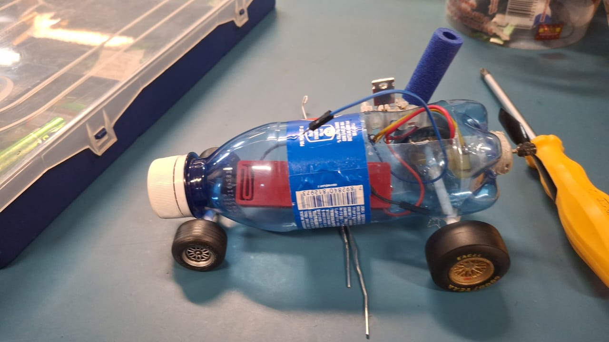

# carrinho mecatrônico
Projeto de um veículo mecatrônico usando sucata de lixo eletrônico.

Este projeto consiste no desenvolvimento de um veículo mecatrônico autônomo ou controlado remotamente, construído a partir da reutilização de lixo eletrônico (e-waste) e materiais de sucata. A iniciativa une conceitos de engenharia mecânica, eletrônica e programação à conscientização ambiental, demonstrando como resíduos tecnológicos descartados podem ganhar uma nova vida útil através da robótica educacional.

## Autores
- Gabriella
- Jamile
- Millena
- Raphaella

## Objetivo
- Sustentabilidade: Reduzir o impacto ambiental do lixo eletrônico por meio da logística reversa e do upcycling (reutilização criativa).
- Interdisciplinaridade: Aplicar conceitos práticos de mecatrônica, como cinemática, circuitos elétricos, soldagem e lógica de programação.
- Baixo Custo: Criar um protótipo funcional minimizando a compra de componentes novos, utilizando o que seria descartado

---
## Simulador do projeto
[simulador](https://www.tinkercad.com/things/hzgKnSdj5Wt-carrinho?sharecode=hbV3Fze8Z-8JBPMnx0S89FvmKcjXlmfALEmfM_G3T2c)
